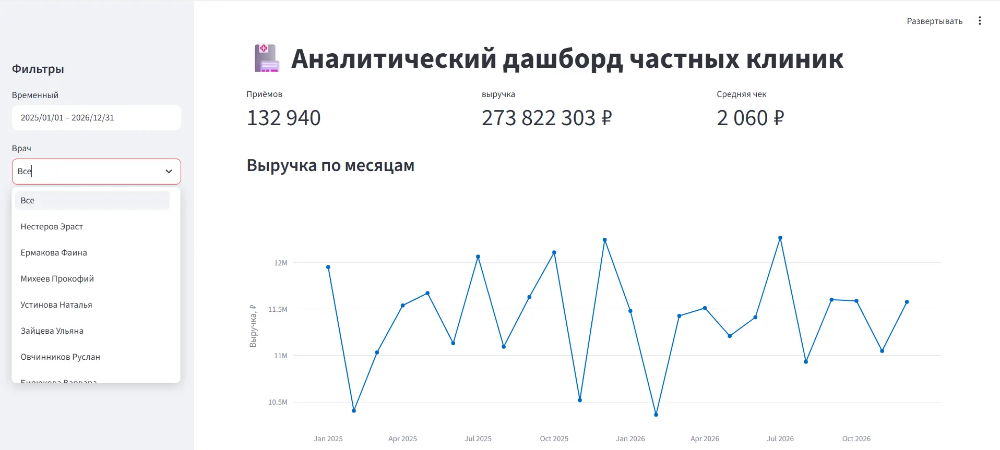
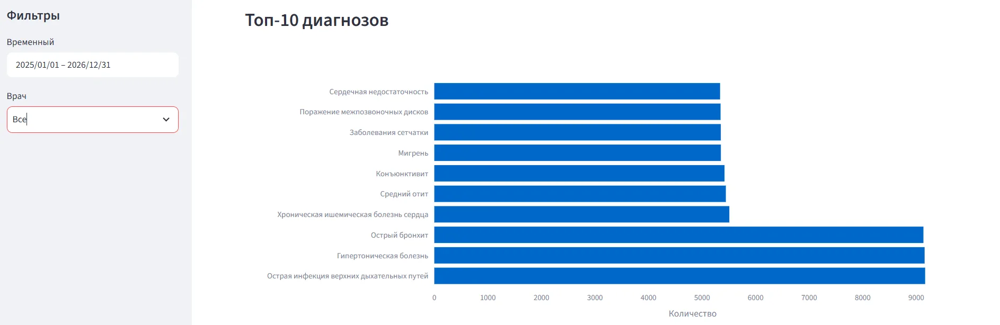
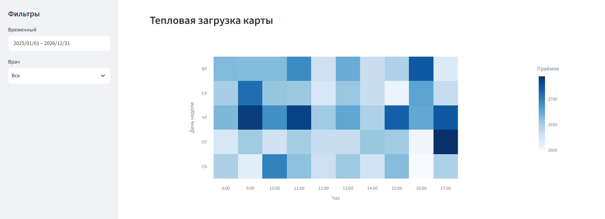
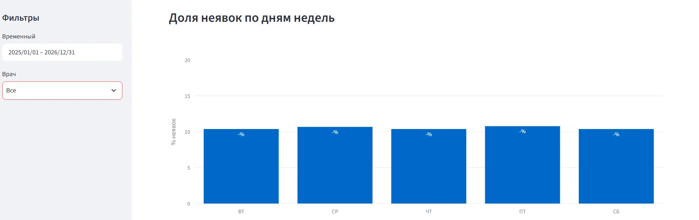
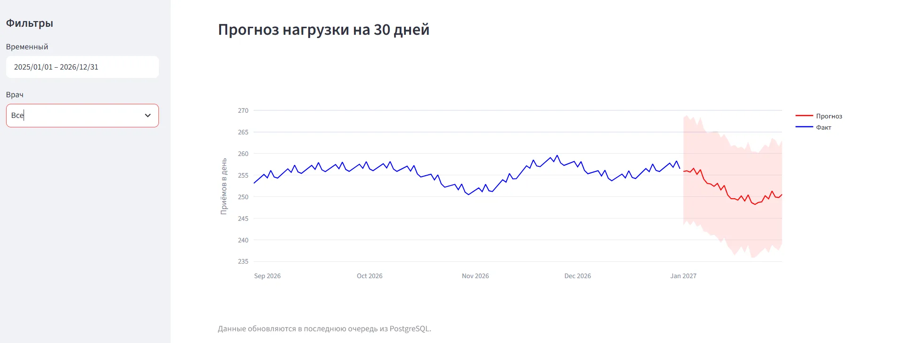

# Аналитический дашборд частной клиники

Проект демонстрирует полный цикл работы с данными: от генерации синтетических медицинских данных до интерактивного дашборда с ML-прогнозом нагрузки.

## Стек
- **Python:** pandas, SQLAlchemy, Streamlit, Plotly, Prophet
- **SQL:** PostgreSQL, оконные функции, CTE, индексы
- **DevOps:** Docker, docker-compose

## Что внутри
- 5 000 пациентов, 20 врачей, 150 000+ записей на приём за 2 года
- Реляционная схема с индексами и внешними ключами
- Интерактивный дашборд с фильтрами по дате и врачу:
  - Ключевые метрики (приёмы, выручка, средний чек)
  - Выручка по месяцам
  - Топ-10 диагнозов
  - Тепловая карта загрузки по часам и дням недели
  - Доля неявок
  - Прогноз нагрузки на 30 дней (Prophet)
- ML-модель прогнозирования нагрузки

## Скриншоты

## Быстрый старт

git clone https://github.com/annkomyagina/clinic-dashboard.git
cd clinic-dashboard
docker-compose up -d

Открыть в браузере: http://localhost:8501

## Структура проекта

'clinic-dashboard/
├── data/                  # Сгенерированные данные
├── sql/                   # SQL-скрипты
│   ├── schema.sql         # Создание таблиц
│   └── queries.sql        # Аналитические запросы
├── scripts/               # Python-скрипты
│   ├── generate_data.py   # Генерация данных
│   ├── load_data.py       # Загрузка в БД
│   └── train_model.py     # Обучение Prophet
├── app.py                 # Streamlit-дашборд
├── Dockerfile
├── docker-compose.yml
└── README.md'
